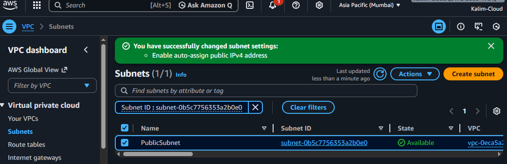
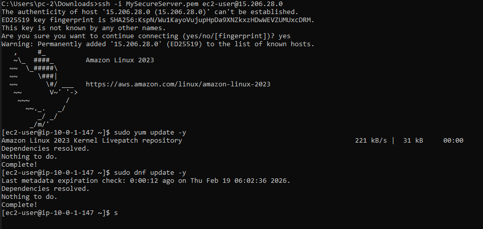
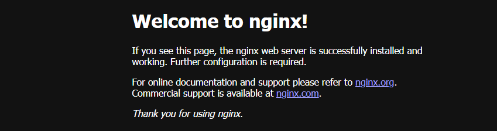
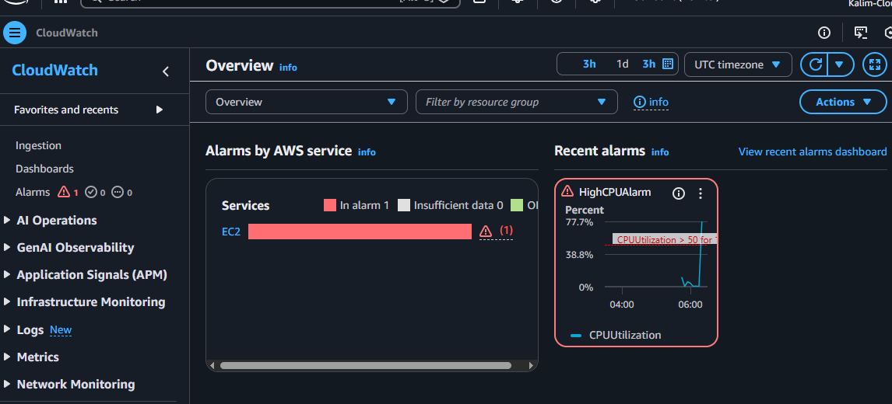
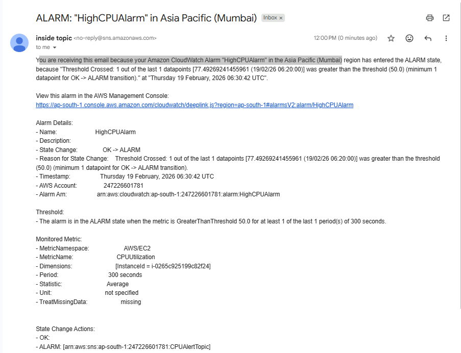

# Secure AWS Cloud Infrastructure Project

## 📌 Project Overview
This project demonstrates the design and deployment of a secure AWS cloud infrastructure using core AWS services. The architecture includes a custom VPC, EC2 instance deployment, IAM role-based access control, private S3 storage, and CloudWatch monitoring with SNS alert notifications.

The goal of this project was to implement security best practices, monitoring, and real-world cloud architecture design.

---

## 🏗️ Architecture Components

- Amazon VPC (Custom CIDR: 10.0.0.0/16)
- Public Subnet (10.0.1.0/24)
- Internet Gateway
- Route Table (0.0.0.0/0 → IGW)
- Amazon EC2 (Amazon Linux 2023)
- IAM Role (S3 ReadOnly + CloudWatch access)
- Amazon S3 (Private bucket)
- Amazon CloudWatch (CPU Monitoring)
- Amazon SNS (Email Alerts)

---

## 🔐 Security Implementation

- Implemented least-privilege IAM role for EC2
- Avoided hardcoded AWS access keys
- Enabled restricted SSH access (My IP only)
- Blocked public access to S3 bucket
- Used security groups to control HTTP & SSH traffic

---

## 🌐 Web Server Deployment

- Installed and configured Nginx on Amazon Linux
- Successfully hosted a live web server
- Verified public access via EC2 public IP

---

## 📊 Monitoring & Alerting

- Created CloudWatch CPU utilization alarm
- Configured threshold (>50%)
- Integrated SNS email notifications
- Tested alarm using CPU stress command
- Successfully received alert email

---

## 🧪 Testing Performed

- Verified IAM role by accessing S3 without access keys
- Triggered CloudWatch alarm using CPU stress test
- Validated secure network routing and internet access

---

## 📁 Project Screenshots

Screenshots available in the `/screenshots` folder:
- VPC Configuration
- EC2 Instance Running
- Nginx Web Server
- IAM Role Attachment
- S3 Bucket
- CloudWatch Alarm
- SNS Email Alert

---

## 🎯 Key Learnings

- AWS networking fundamentals (VPC, Subnets, IGW, Route Tables)
- IAM role-based secure access
- Linux server configuration on EC2
- Cloud monitoring and alert automation
- Secure cloud architecture design

---

## 📸 Architecture & Screenshots

### VPC Setup

### EC2 Instance Running

### Nginx Web Server

### CloudWatch Alarm Triggered

### SNS Email Notification

---

## 🚀 Author

Kalimullah Khan  
Aspiring Cloud Engineer  
GitHub: https://github.com/kalimkhan-dev
